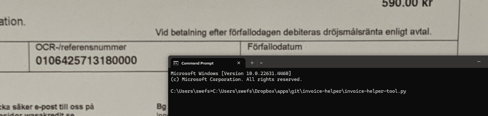

# invoice-helper
Make double-checking long series of numbers faster and more efficient

## Example usage



## Requirements

1. **Python 3.7+**: Make sure you have Python installed. You can download it from [python.org](https://www.python.org).

2. **Build Tools for C#**: Required for installing `pytesseract` on Windows.
   - Download and install from [Microsoft Build Tools](https://visualstudio.microsoft.com/visual-cpp-build-tools/).

3. **Tesseract-OCR**: External OCR software required for `pytesseract`.
   - Download it from [Tesseract GitHub](https://github.com/tesseract-ocr/tesseract).

## How to use

1. Clone or download the repository:
   ```bash
   git clone git@github.com:jakobvonessen/invoice-helper.git
   cd invoice-helper
   ```
2. Run `invoice-helper-tool.py`:
   ```bash
   python ./invoice-helper-tool.py
   ```